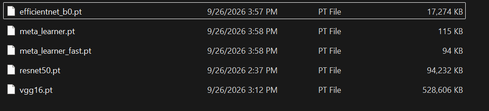

# HIICNN — Hybrid Image-Improving and CNN Stacking Ensemble for Traffic Sign Recognition

A PyTorch pipeline for the GTSRB benchmark (43 German traffic sign classes) combining classical image-enhancement preprocessing with a stacking ensemble of three ImageNet-pretrained CNN backbones — ResNet50, VGG16, and EfficientNet-B0 — partially fine-tuned (with **per-backbone hyperparameters**) and fused by a learned meta-learner, with fp32/fp16 latency-FPS reporting for a real-time autonomous-driving framing.

Implemented end-to-end in a single notebook: **`HIICNN_improved.ipynb`**.

## Results

Measured on the official GTSRB test split.

| Model                                                           |     Accuracy     |    Precision    |      Recall      |        F1        |
| --------------------------------------------------------------- | :--------------: | :--------------: | :--------------: | :--------------: |
| ResNet50                                                        |      80.46%      |      74.13%      |      76.37%      |      74.54%      |
| VGG16                                                           |      80.32%      |      78.62%      |      75.86%      |      76.55%      |
| **EfficientNet-B0**                                       | **94.34%** | **92.82%** | **93.09%** | **92.85%** |
| Naive-average ensemble (3 backbones)                            |      93.77%      |      92.42%      |      92.39%      |      92.25%      |
| HIICNN stacking ensemble (3 backbones)                          |    *94.11%*    |    *93.20%*    |    *92.97%*    |    *92.99%*    |
| HIICNN fast stacking ensemble (2 backbones, no EfficientNet-B0) |      85.16%      |      82.78%      |      80.73%      |      81.31%      |

### Inference latency (single image, batch size 1)

|                                                                | Model                                                                           |   ms / image   |       FPS       |   Precision   |
| -------------------------------------------------------------- | ------------------------------------------------------------------------------- | :------------: | :--------------: | :------------: |
|                                                                | ResNet50                                                                        |      5.10      |      196.0      |      fp16      |
|                                                                | EfficientNet-B0                                                                 |      6.66      |      150.2      |      fp16      |
|                                                                | VGG16                                                                           | **3.87** | **257.97** | **fp16** |
| HIICNN stacking ensemble<br />*Naive-average (same latency)* | HIICNN full ensemble (3 backbones)<br />`HIICNN_full_ensemble_fp32`           |      9.37      |      106.7      |      fp32      |
| HIICNN stacking ensemble<br />*Naive-average (same latency)* | HIICNN full ensemble (3 backbones)<br />**`HIICNN_full_ensemble_fp16`** |     12.56     |       79.6       |      fp16      |
| HIICNN fast stacking ensemble                                  | HIICNN fast ensemble (2 backbones)<br />`HIICNN_fast_ensemble_fp32`           |    *5.06*    |    *197.5*    |    *fp32*    |
| HIICNN fast stacking ensemble                                  | HIICNN fast ensemble (2 backbones)<br />`HIICNN_fast_ensemble_fp16`           |      6.03      |      165.9      |      fp16      |

> **Real-time target met.** With `USE_AMP` training-time mixed precision, the smaller `IMAGE_SIZE=112` input, and the fp32/fp16 benchmarking added in the second round of changes, the full 3-backbone HIICNN ensemble now runs at **106.7 FPS (fp32)** — comfortably past the conventional ≥30 FPS real-time bar, with no need to drop EfficientNet-B0 at all.
>
> **Counterintuitive finding:** fp16 autocast inference (`USE_AMP_INFERENCE`) is actually *slower* than fp32 for both ensembles here (106.7→79.6 FPS
> full, 197.5→165.9 FPS fast). At `batch_size=1` on these relatively small, already-fast backbones, autocast's per-op dtype-casting overhead outweighs any kernel speedup — fp16 tends to pay off at larger batch sizes or on bigger models. So fp32 is the better choice for this single-frame real-time setting, and `USE_AMP_INFERENCE` is left in the notebook mainly so this trade-off is measured rather than assumed.

## 1. Architecture overview

```
raw GTSRB image
      │
      ▼
┌─────────────────────────────┐
│  Image Enhancement Stage    │  CLAHE contrast → unsharp mask → sharpening kernel
└─────────────────────────────┘
      │
      ▼
   Resize to 112×112, normalize (ImageNet mean/std)
      │
      ├──────────────┬──────────────┬───────────────┐
      ▼              ▼              ▼
  ResNet50        VGG16        EfficientNet-B0       per-backbone unfreeze
  (43-way head)  (43-way head)  (43-way head)         depth + LR (see
      │              │              │                 PER_MODEL_CONFIG);
      ▼              ▼              ▼                 new head at a
  softmax(43)    softmax(43)    softmax(43)           larger LR
      └──────────────┴──────────────┘
                     │  concat → 129-d vector
                     ▼
            Meta-Learner (small MLP)
            trained in mini-batches with
            a held-out meta-val split
                     │
                     ▼
             Final 43-class prediction

  (A second meta-learner is trained/evaluated over just ResNet50 + VGG16 —
   see "HIICNN fast ensemble" above — for accuracy/latency comparison.)
```

## 2. Preprocessing / image enhancement

Three classical techniques are chained, in order, before resizing:

1. **CLAHE contrast enhancement** — adaptive histogram equalization on the L-channel of LAB color space, to recover detail in over/under-exposed sign photos (glare, shadows, dusk driving conditions).
2. **Unsharp masking** — Gaussian-blur the image, subtract it from the original, and add the result back, boosting edge contrast across the whole sign.
3. **Sharpening convolution kernel** — a cheap 3×3 kernel (`[[0,-1,0],[-1,5,-1],[0,-1,0]]`) for a final edge-emphasis pass, cheap enough to run per-frame in a real-time system.

Images are then resized to 112×112 and normalized with ImageNet statistics, since all three backbones use ImageNet-pretrained weights. Toggles for each stage (`USE_CLAHE_CONTRAST`, `USE_UNSHARP_MASK`, `USE_SHARPENING`) live in the config cell.

### Dataset layout expected

[www.kaggle.com/datasets/meowmeowmeowmeowmeow/gtsrb-german-traffic-sign](https://www.kaggle.com/datasets/meowmeowmeowmeowmeow/gtsrb-german-traffic-sign)

The dataset-loading cell reads the standard Kaggle-mirror GTSRB layout, expected directly under `DATA_ROOT` (`data/` by default):

```
data/
├── Train/                # per-class subfolders (0..42) of training images
├── Test/                 # flat folder of test images
├── Meta/                 # per-class reference icons
├── Train.csv             # Width,Height,Roi.X1,Roi.Y1,Roi.X2,Roi.Y2,ClassId,Path
├── Test.csv
└── Meta.csv
```

`GTSRBCSVDataset` reads the `Path`/`ClassId` columns to locate each image and label, and crops to the `Roi.X1/Y1/X2/Y2` bounding box (the nnotated sign region within the padded raw image) before handing the image to the  enhancement/resize pipeline.

## 3. Base models / stacking

- Each backbone (ResNet50, VGG16, EfficientNet-B0) is loaded with ImageNet weights via `torchvision.models`. Rather than a single frozen/unfrozen switch, each backbone fine-tunes its **last block(s)**, while a new head (`Linear → BatchNorm/ReLU → Dropout → Linear(43)`) trains on top at a larger learning rate. Fully-frozen ImageNet features don't transfer well to small, tightly-cropped traffic-sign icons — a domain quite different from the ImageNet photos they were pretrained on — so this partial fine-tuning is the main driver behind the accuracy jump from ~50% (fully frozen) to 80%+/94%+ per backbone.
- **Per-model hyperparameters** (`PER_MODEL_CONFIG`), added because a single shared recipe previously left EfficientNet-B0 far behind the other two backbones. Its compact, resolution-sensitive MBConv design needed more capacity and time to adapt to 112×112 crops than ResNet50/VGG16 did:

  | Backbone        | Unfreeze depth                      | Backbone LR | Epochs | Early-stop patience |
  | --------------- | ----------------------------------- | :---------: | :----: | :-----------------: |
  | ResNet50        | last block (`layer4`)             |    1e-5    |   20   |          5          |
  | VGG16           | last conv block (`features[24:]`) |    1e-5    |   20   |          5          |
  | EfficientNet-B0 | last 3 MBConv stages                |    3e-5    |   25   |         10         |

  Head LR is `1e-3` for all three. This closed almost all of the EfficientNet-B0 gap — see [Results](#results).
- Training batches use **class-weighted sampling** (`USE_WEIGHTED_SAMPLER`) to counter GTSRB's heavy per-class imbalance, plus label smoothing, AdamW, mixed precision, and each backbone's own early-stopping patience; the best checkpoint (by held-out validation accuracy) is saved.
- **Stacking meta-learner** (`MetaLearner`): a small MLP that takes the concatenated 43-dim softmax vectors from the ensemble's backbones (129 inputs for the full 3-backbone ensemble, 86 for the fast 2-backbone one) and learns to weight/combine them into a final prediction — this is what distinguishes HIICNN from a naive averaging ensemble. It's trained on a held-out validation split that none of the backbones were directly trained on (correct stacking practice), using real mini-batches, AdamW, and cosine LR decay, with its own held-out meta-validation slice so training can be checked for convergence rather than run blind.
- **Fast 2-backbone ensemble** (`FAST_ENSEMBLE_BACKBONES = ["resnet50", "vgg16"]`): a second meta-learner (`meta_learner_fast.pt`), trained and evaluated/benchmarked side-by-side with the full 3-backbone ensemble, so the accuracy-vs-speed trade-off of dropping EfficientNet-B0 is visible in the numbers rather than assumed — see [Results](#results). With per-model tuning now making EfficientNet-B0 the strongest backbone, dropping it costs ~9 points of accuracy for roughly 2x the throughput, which is a much worse trade than it looked like before that fix.
- The evaluation cell also reports a **naive-average ensemble** baseline (simple mean of the three softmax outputs) alongside the trained stacking ensemble, so the value added by the meta-learner is visible.

## 4. Real-time framing

The benchmarking cell reports per-image latency (ms) and throughput (FPS) for each backbone individually, and for the full 3-backbone and fast 2-backbone HIICNN ensembles end-to-end (backbones + meta-learner combined into a single forward pass via `EnsembleWrapper`) — each ensemble measured at both fp32 and fp16 (`USE_AMP_INFERENCE`, via `torch.autocast`).

Numbers are measured with `batch_size=1` (the realistic single-frame case for an onboard camera), CUDA-synchronized where available, after a warmup period. Results are saved to `results_improved/latency_benchmark.json`.

See the [latency table above](#inference-latency-single-image-batch-size-1) for current numbers, including the fp32-beats-fp16 finding at this batch size.

## 5. Evaluation

On the official GTSRB test split, the evaluation cell reports, for every backbone and for both ensembles (full 3-backbone and fast 2-backbone):

- Accuracy
- Macro Precision / Recall / F1-score
- Confusion matrix (plotted per model)
- A JSON comparison table (`results_improved/comparison_table.json`) covering single-backbone vs. stacking-ensemble vs. naive-average vs.
  fast-ensemble performance

## 6. Project layout

```
HIICNN/
├── HIICNN_improved.ipynb    # everything: config, enhancement, dataset,
│                             # models, training, evaluation, benchmarking
├── checkpoints_improved/     # saved model weights (resnet50.pt, vgg16.pt,
│                             # efficientnet_b0.pt, meta_learner.pt,
│                             # meta_learner_fast.pt)
├── results_improved/
│   ├── comparison_table.json     # accuracy / precision / recall / F1
│   └── latency_benchmark.json    # ms-per-image and FPS per model/precision
└── data/                     # GTSRB dataset (Kaggle layout, not committed)
```

### Checkpoint sizes on disk

| File                                    |    Size (MB)    |
| --------------------------------------- | :--------------: |
| `vgg16.pt`                            |      516.2      |
| `resnet50.pt`                         |       92.0       |
| `efficientnet_b0.pt`                  |       16.9       |
| `meta_learner.pt`                     |       0.11       |
| `meta_learner_fast.pt`                |       0.09       |
| **Total (checkpoints_improved/)** | **~625.3** |



VGG16 dominates the footprint by a wide margin — its dense fully-connected classifier head is much larger than ResNet50's or EfficientNet-B0's global-pooled heads, so it accounts for over 80% of the full ensemble's disk (and load-time memory) cost despite being the fastest backbone at inference. The two meta-learners are negligible in comparison (a few hundred KB combined) — nearly all of the storage cost is the three backbones themselves. Worth keeping in mind alongside the [latency table](#inference-latency-single-image-batch-size-1) if disk space or cold-start load time matters for deployment, not just FPS.

## 7. How to run

### Setup

```bash
# 1. Create Python environment:
python -m venv env

# 2. Activate the environment:
.\env\Scripts\Activate.ps1        # Windows PowerShell
# source env/bin/activate         # macOS/Linux

# 3. Install a CUDA-matched PyTorch build (pick your CUDA version):
#    https://pytorch.org/get-started/locally/
pip install torch torchvision --index-url https://download.pytorch.org/whl/cu121

# 4. Install the rest of the dependencies
pip install pandas numpy opencv-python scikit-learn matplotlib tqdm jupyter
```

Make sure your `data/` folder (`Train/`, `Test/`, `Meta/`, `Train.csv`,
`Test.csv`, `Meta.csv`) sits at the project root, next to the notebook,
before running.

### Run

```bash
jupyter notebook HIICNN_improved.ipynb
```

Run the cells top to bottom: config → enhancement → dataset/dataloaders → backbone/meta-learner definitions → backbone training loop (per-model hyperparameters) → meta-learner training (full ensemble, then the fast 2-backbone ensemble) → evaluation → fp32/fp16 latency benchmark. Each stage saves its checkpoints or results before the next stage needs them, so you can also stop after training and come back later to re-run just evaluation/benchmarking against the saved checkpoints.

## Future work

- **Lean into EfficientNet-B0.** Per-model tuning made it the strongest backbone by a wide margin (94.3% vs. 80.3–80.5%) and it now slightly outperforms the full stacking ensemble on its own. Worth trying a meta-learner that weights it more heavily, or an ensemble of EfficientNet-B0 with a different, more complementary second model instead of ResNet50/VGG16.
- **Investigate the fp16 slowdown.** fp16 autocast inference is slower than fp32 for both ensembles at `batch_size=1`. Worth checking whether this holds at larger batch sizes, whether a real TensorRT/ONNX export (rather than `torch.autocast`) behaves differently, and whether it's worth keeping `USE_AMP_INFERENCE` on by default at all for this deployment shape.
- **Broader fine-tuning sweep.** Now that per-model unfreeze depth/LR/epochs are configurable, sweep them further for ResNet50 and VGG16 too — they still trail EfficientNet-B0 by double digits and might have their own underfitting eadroom.
- **Robustness testing.** Evaluate under weather/lighting corruptions (rain, glare, motion blur, night) relevant to autonomous-driving deployment, not just the clean GTSRB test set.

## License
